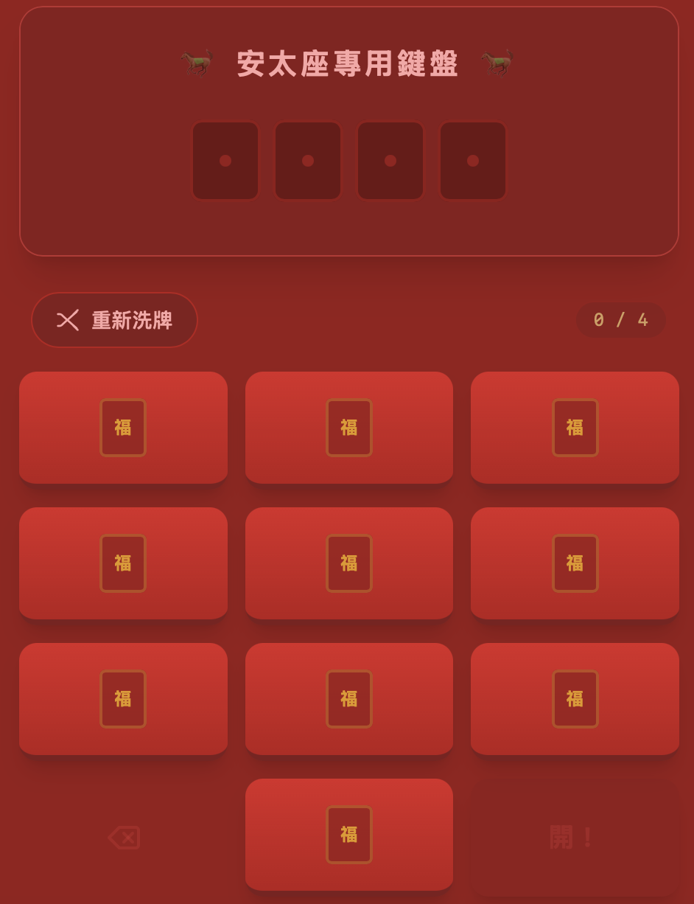

# 🧧 馬年安太座！！- 全盲紅包挑戰

## 🎮 遊戲連結
👉 **[點我開始抽紅包！](https://genehung2003.github.io/Gene-Redenvelope-Blind/)**

## 📖 簡介
這是一個專為 2026 馬年設計的互動式紅包遊戲。
模擬 LinePay 轉帳介面，但**鍵盤位置完全隨機洗牌**！
蒙著眼睛選數字，抽多抽少全憑天意（與勇氣）。

## ✨ 特色
- **4季發財 / 5路財神 / 6六大順** 三種挑戰模式。
- **純粹隨機**：完全沒有作弊機制，首位數字為 0 也是常有的事（笑）。
- **驚喜特效**：開獎後的噴發特效，增加過年儀式感。
- **行動優化**：適合手機瀏覽器直接開啟，分享超方便。

---
製作：**成大外科小洪**
祝大家 2026 馬年行大運，紅包領到手軟！
